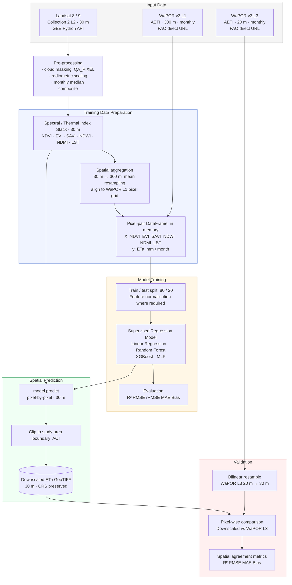

# Downscaling WaPOR ETa from 300 m to 30 m Using Landsat 8/9 and Machine Learning

A generalised framework to downscale WaPOR v3 Level 1 monthly Actual Evapotranspiration (ETa) from **300 m to 30 m** using Landsat 8/9 spectral and thermal indices as predictors and supervised machine learning models.

---

## Methodology



---

## Spectral and Thermal Indices

Six indices are derived from Landsat 8/9 Surface Reflectance (Collection 2 Level-2) and used as model predictors.

**Band notation:** NIR = B5 · Red = B4 · Blue = B2 · Green = B3 · SWIR1 = B6 · SWIR2 = B7 · TIR = B10

| Index | Full Name | Formula | Physical Rationale |
|---|---|---|---|
| **NDVI** | Normalised Difference Vegetation Index | (NIR − Red) / (NIR + Red) | Measures green leaf density and photosynthetic activity; strongly correlated with transpiration |
| **EVI** | Enhanced Vegetation Index | 2.5 × (NIR − Red) / (NIR + 6·Red − 7.5·Blue + 1) | Reduces soil background and atmospheric noise compared to NDVI; more sensitive in dense canopies |
| **SAVI** | Soil-Adjusted Vegetation Index | 1.5 × (NIR − Red) / (NIR + Red + 0.5) | Minimises soil brightness effects; well-suited to sparsely vegetated or irrigated areas |
| **NDWI** | Normalised Difference Water Index | (Green − NIR) / (Green + NIR) | Highlights open water and surface moisture; indicates non-vegetated wet surfaces |
| **NDMI** | Normalised Difference Moisture Index | (NIR − SWIR1) / (NIR + SWIR1) | Sensitive to canopy water content and plant water stress; directly linked to actual ET |
| **LST** | Land Surface Temperature | Derived from TIR (B10) → converted to °C | Directly related to latent heat flux; cool surfaces indicate high ET, warm surfaces low ET |

> Surface reflectance bands are scaled by `× 0.0000275 + (−0.2)` per Landsat Collection 2 Level-2 convention.
> LST is converted to °C using the ST_B10 scale factor provided by USGS.

---

## Setup

### 1: Install Conda (Recommended)

Conda is a cross-platform environment manager that makes it easy to install geospatial libraries like GDAL.

#### Windows

1. Download the **Miniconda installer**:  
 [Miniconda Windows 64-bit](https://docs.conda.io/en/latest/miniconda.html#windows-installers)
2. Run the installer and choose “Add Miniconda to PATH” during setup.
3. After installation, open **Anaconda Prompt** or **Command Prompt** and test:

```bash
conda --version
```

#### macOS

1. Download the installer for macOS from:  
    [Miniconda macOS](https://docs.conda.io/en/latest/miniconda.html#macos-installers)

2. Run the installer

3. Restart terminal and verify:

```bash
conda --version
```

### 2. Create the Conda Environment

```bash
# Create and activate the conda environment
conda env create -f environment.yml
conda activate condaml
```

---

### 3. Run

```bash
python main.py
```


This runs the full pipeline:
- downloads and preprocesses data
- generates predictor variables
- trains machine learning models

---
