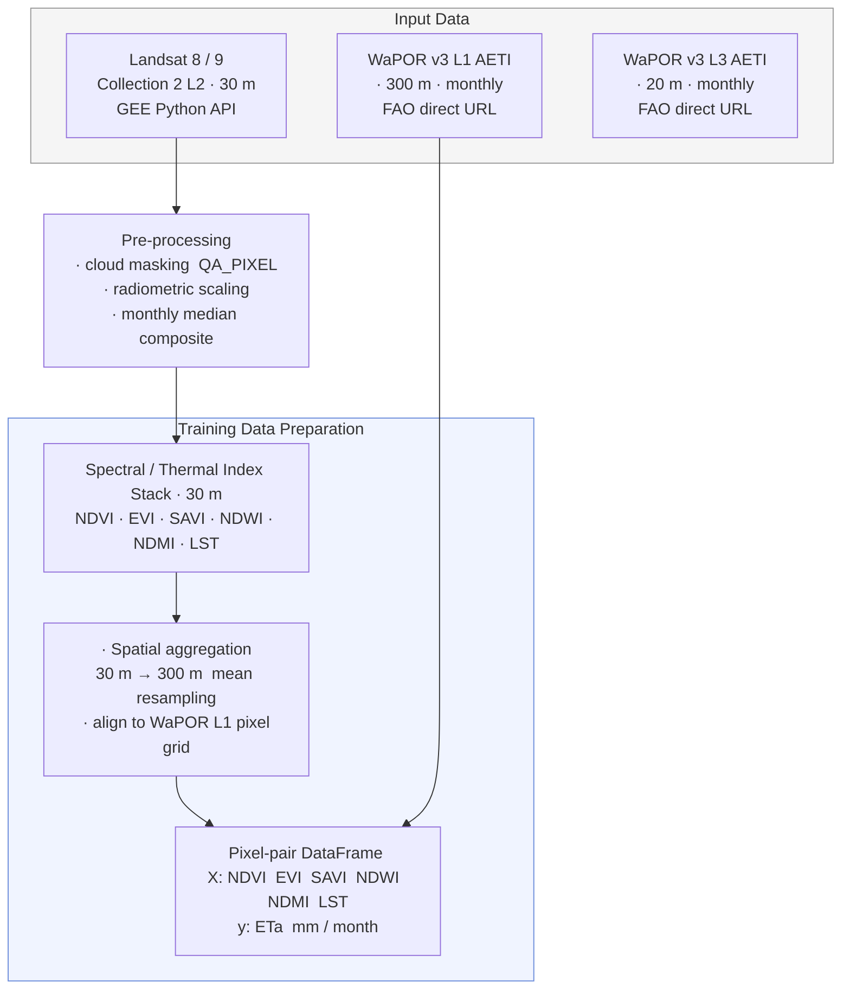
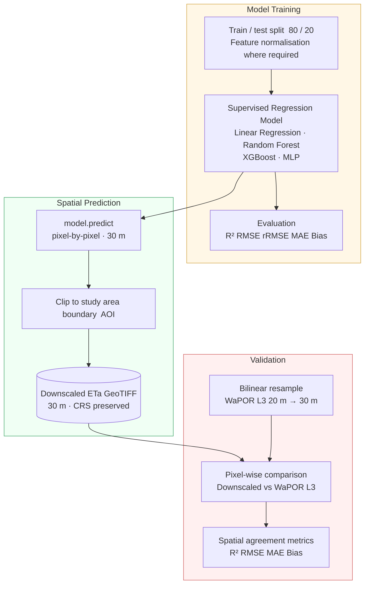
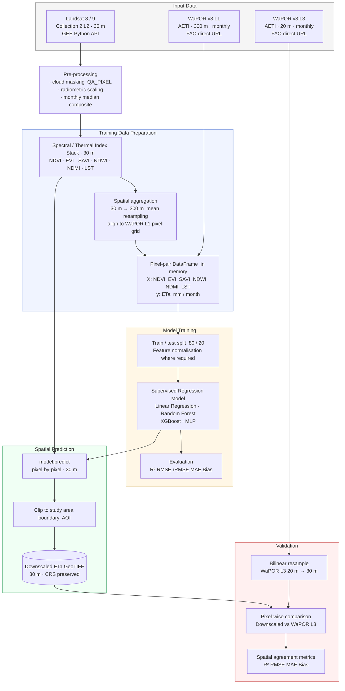
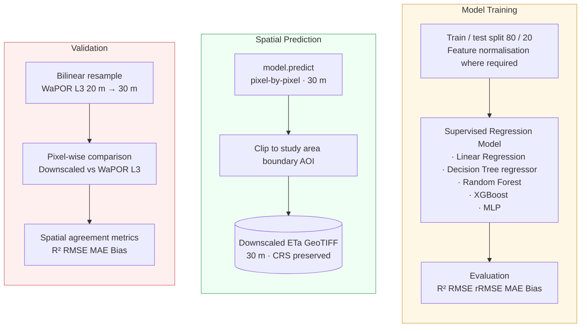

https://markdownviewer.pages.dev/

```mermaid
flowchart TD
    %% ── Input Data ────────────────────────────────────────────
    subgraph SRC ["Input Data"]
        direction LR
        L8["Landsat 8 / 9<br/>Collection 2 L2 · 30 m<br/>GEE Python API"]
        W1["WaPOR v3 L1 AETI <br/>· 300 m · monthly<br/>FAO direct URL"]
        W3["WaPOR v3 L3 AETI <br/>· 20 m · monthly<br/>FAO direct URL"]
    end

    %% ── Pre-processing ────────────────────────────────────────
    L8 --> P["Pre-processing<br/>· cloud masking  QA_PIXEL<br/>· radiometric scaling<br/>· monthly median composite"]
    P  --> I["Spectral / Thermal Index Stack · 30 m<br/>NDVI · EVI · SAVI · NDWI · NDMI · LST"]

    %% ── Training data preparation ─────────────────────────────
    subgraph TRAIN ["Training Data Preparation"]
        I  --> AGG["· Spatial aggregation<br/>30 m → 300 m  mean resampling<br/> · align to WaPOR L1 pixel grid"]
        AGG --> PAIR["Pixel-pair DataFrame <br/>X: NDVI  EVI  SAVI  NDWI  NDMI  LST<br/>y: ETa  mm / month"]
        W1 --> PAIR
    end


    %% ── Styles ────────────────────────────────────────────────
    style SRC   fill:#f5f5f5,stroke:#999999
    style TRAIN fill:#f0f4ff,stroke:#6b8cda

```

```mermaid
flowchart TD


    %% ── Model training ────────────────────────────────────────
    subgraph ML ["Model Training"]
        SPLIT["Train / test split  80 / 20<br/>Feature normalisation where required"]
        SPLIT --> MODEL["Supervised Regression Model<br/>Linear Regression · Random Forest<br/>XGBoost · MLP"]
        MODEL --> EVAL["Evaluation<br/>R²  RMSE  rRMSE  MAE  Bias"]
    end

    %% ── Spatial prediction ────────────────────────────────────
    subgraph PRED ["Spatial Prediction"]
        PREDICT["model.predict<br/>pixel-by-pixel · 30 m"]
        MODEL --> PREDICT
        PREDICT --> CLIP["Clip to study area boundary  AOI"]
        CLIP    --> TIFF[("Downscaled ETa GeoTIFF<br/>30 m · CRS preserved")]
    end

    %% ── Validation ────────────────────────────────────────────
    subgraph VAL ["Validation"]
         RESAMP["Bilinear resample<br/>WaPOR L3  20 m → 30 m"]
        TIFF --> COMPARE["Pixel-wise comparison<br/>Downscaled vs WaPOR L3"]
        RESAMP --> COMPARE
        COMPARE --> METRICS["Spatial agreement metrics<br/>R²  RMSE  MAE  Bias"]
    end

    %% ── Styles ────────────────────────────────────────────────
    style ML    fill:#fff7e6,stroke:#d4a84b
    style PRED  fill:#f0fff4,stroke:#4dab72
    style VAL   fill:#fff0f0,stroke:#d46b6b
```

```mermaid
flowchart TD
    %% ── Input Data ────────────────────────────────────────────
    subgraph SRC ["Input Data"]
        direction LR
        L8["Landsat 8 / 9<br/>Collection 2 L2 · 30 m<br/>GEE Python API"]
        W1["WaPOR v3 L1<br/>AETI · 300 m · monthly<br/>FAO direct URL"]
        W3["WaPOR v3 L3<br/>AETI · 20 m · monthly<br/>FAO direct URL"]
    end

    %% ── Pre-processing ────────────────────────────────────────
    L8 --> P["Pre-processing<br/>· cloud masking  QA_PIXEL<br/>· radiometric scaling<br/>· monthly median composite"]
    P  --> I["Spectral / Thermal Index Stack · 30 m<br/>NDVI · EVI · SAVI · NDWI · NDMI · LST"]

    %% ── Training data preparation ─────────────────────────────
    subgraph TRAIN ["Training Data Preparation"]
        I  --> AGG["Spatial aggregation<br/>30 m → 300 m  mean resampling<br/>align to WaPOR L1 pixel grid"]
        AGG --> PAIR["Pixel-pair DataFrame  in memory<br/>X: NDVI  EVI  SAVI  NDWI  NDMI  LST<br/>y: ETa  mm / month"]
        W1 --> PAIR
    end

    %% ── Model training ────────────────────────────────────────
    subgraph ML ["Model Training"]
        PAIR  --> SPLIT["Train / test split  80 / 20<br/>Feature normalisation where required"]
        SPLIT --> MODEL["Supervised Regression Model<br/>Linear Regression · Random Forest<br/>XGBoost · MLP"]
        MODEL --> EVAL["Evaluation<br/>R²  RMSE  rRMSE  MAE  Bias"]
    end

    %% ── Spatial prediction ────────────────────────────────────
    subgraph PRED ["Spatial Prediction"]
        I     --> PREDICT["model.predict<br/>pixel-by-pixel · 30 m"]
        MODEL --> PREDICT
        PREDICT --> CLIP["Clip to study area boundary  AOI"]
        CLIP    --> TIFF[("Downscaled ETa GeoTIFF<br/>30 m · CRS preserved")]
    end

    %% ── Validation ────────────────────────────────────────────
    subgraph VAL ["Validation"]
        W3   --> RESAMP["Bilinear resample<br/>WaPOR L3  20 m → 30 m"]
        TIFF --> COMPARE["Pixel-wise comparison<br/>Downscaled vs WaPOR L3"]
        RESAMP --> COMPARE
        COMPARE --> METRICS["Spatial agreement metrics<br/>R²  RMSE  MAE  Bias"]
    end

    %% ── Styles ────────────────────────────────────────────────
    style SRC   fill:#f5f5f5,stroke:#999999
    style TRAIN fill:#f0f4ff,stroke:#6b8cda
    style ML    fill:#fff7e6,stroke:#d4a84b
    style PRED  fill:#f0fff4,stroke:#4dab72
    style VAL   fill:#fff0f0,stroke:#d46b6b
```

<!-- Second part:  Training, Prediction, Validation-->

```mermaid
flowchart TD
    %% ── Input Data ────────────────────────────────────────────


    subgraph ML ["Model Training"]
        direction TB
        SPLIT["Train / test split 80 / 20<br/>Feature normalisation where required"]
        --> MODEL["Supervised Regression Model<br/>· Linear Regression <br/>· Decision Tree regressor<br/>· Random Forest<br/>· XGBoost <br/>· MLP"]
        --> EVAL["Evaluation<br/>R² RMSE rRMSE MAE Bias"]
    end

    subgraph PRED ["Spatial Prediction"]
        direction TB
        PREDICT["model.predict<br/>pixel-by-pixel · 30 m"]
        --> CLIP["Clip to study area boundary AOI"]
        --> TIFF[("Downscaled ETa GeoTIFF<br/>30 m · CRS preserved")]
    end

    subgraph VAL ["Validation"]
        direction TB
        RESAMP["Bilinear resample<br/>WaPOR L3 20 m → 30 m"]
        --> COMPARE["Pixel-wise comparison<br/>Downscaled vs WaPOR L3"]
        --> METRICS["Spatial agreement metrics<br/>R² RMSE MAE Bias"]
    end

    style ML      fill:#fff7e6,stroke:#d4a84b
    style PRED    fill:#f0fff4,stroke:#4dab72
    style VAL     fill:#fff0f0,stroke:#d46b6b
```
